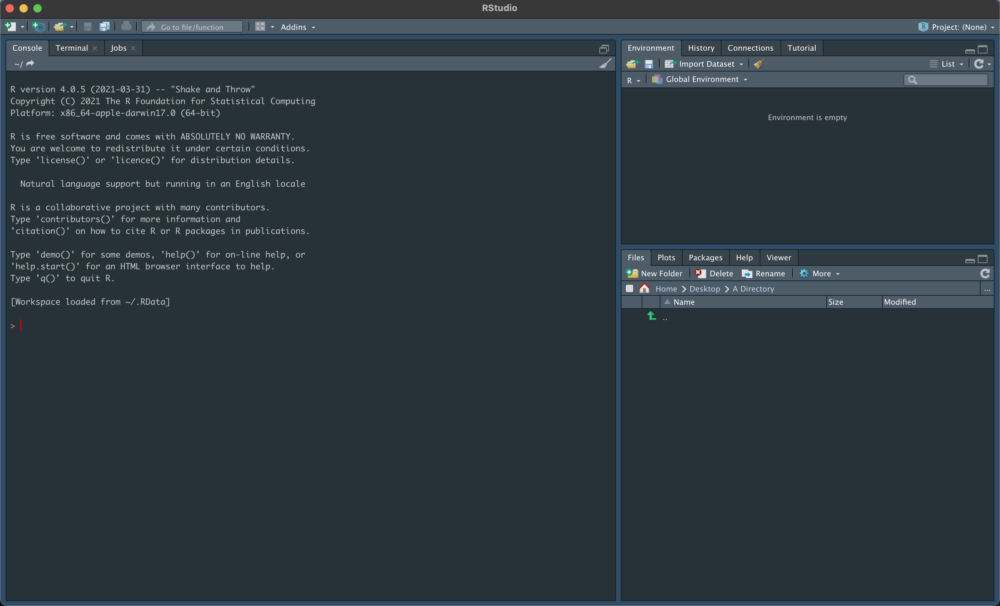
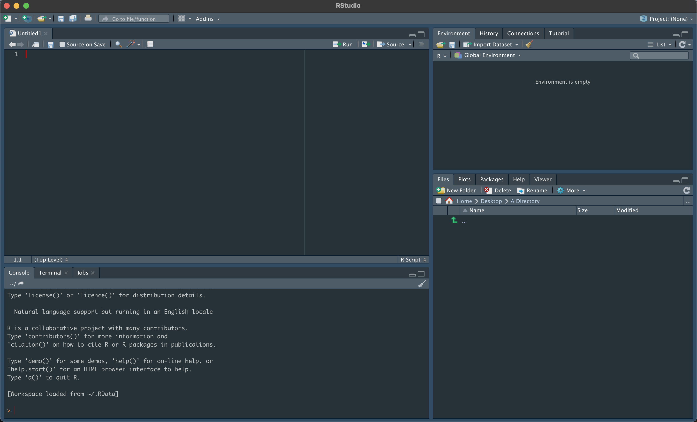

---
# Please do not edit this file directly; it is auto generated.
# Instead, please edit 01-Data-Prep.md in _episodes_rmd/
title: "Data Preparation"
teaching: 45
exercises: 10
questions:
- "What data will we be using?"
- "How do I load the data?"
objectives:
- "Introduction to RStudio"
- "Loading the data"
keypoints:
-
output: html_document
---


<script type="text/javascript" id="MathJax-script" async
  src="https://cdn.jsdelivr.net/npm/mathjax@3/es5/tex-mml-chtml.js">
</script>


# Introduction to RStudio

We will be using RStudio throughout this workshop and so the first prerequisite is installing [R](https://www.r-project.org/) and [RStudio](https://www.rstudio.com/products/rstudio/).
Upon installing and opening RStudio, you will be greeted by three panels:

* The interactive R console/Terminal (entire left)
* Environment/History/Connections (tabbed in upper right)
* Files/Plots/Packages/Help/Viewer (tabbed in lower right)



Opening a text file (such as an R or Rmd file) in RStudio will open the file in a new panel in the top left.



There are two main ways that you can run R commands or scripts within RStudio:

1. The interactive R console
  * This works well when running individual lines to test code and when starting your analysis
  * It can become laborious and inefficient and is not suitable when running many commands at once.
2. Writing in a .R file
  * All of your code is saved for editing and later use
  * You can run as many lines as you wish at once

The hash symbol (#) can be used to signal text in our script file that should not be run, which are called comments.
An example of using comments to describe code is shown below.


```r
# Chunk of code that will add two numbers together

1 + 2 # Adds one and two together
```


> ## Tip: Running segments of code
>
> There are a few ways you can run lines of code from a .R file.
> If you want to run a single line, place your cursor at the end of the line, or if you want to run multiple lines, select the lines you would like to run.
> We have a few options for running the code:
>
> * click on the Run button above the editor panel, or
> * hit Ctrl+Return (⌘+Return also works if you are using OS X)
>
> If you edit a segment of code after running it and want to quickly re-run the segment, you can press the button to the right of the Run button above the editor panel to re-run the previous code region.
{: .callout}

> ## Tip: Getting help in R
>
> For help with any function in R, put a question mark before the function name to determine what arguments to use, examples and other background information.
For example, running `? hist` will you a description for base R's function to generate a histogram.
>
> If you don't know the name of the function you want, you can use two question marks (??) to search for functions relating to a keyword (e.g. `?? histogram`)
>
{: .callout}

# First Example - Data Dictionary

Today, we will be working on two data sets throughout the day to understand correlation and linear regression in R.

In our first example we will use a data set consisting of 100 individuals with 13 different measurements taken.
This is data of medical records, vitals and clinical examinations of participants with heart disease.
Descriptions of the 13 variables are given in the data dictionary below.

Variable    | Description
--------    | -----------
Age         | Age in years
Sex         | Sex; 0=Female, 1=Male
Cp          | Chest Pain; 1=Typical Angina, 2=Atypical Angina, 3=Non-Anginal pain, 4=Asymptomatic
Trestbps    | Resting Systolic BP in mmHg
Chol        | Blood Cholesterol Level in mg/dl
Fbs         | Fasting Blood Sugar;  0 =  less than 120mg/dl  and 1= greater than 120 mg/dl
Exang       | Exercise Induced Angina;  0=No, 1=Yes
Thalach     | Maximum Heart Rate Achieved
Old Peak ST | ST wave depression induced by exercise
Slope       | The slope of peak exercise segment;  1=Up-sloping, 2=Flat, 3=Down Sloping
Ca          | Number of major vessels coloured by fluoroscopy
Class       | Diagnosis Class; 0=No disease, 1-4 Various stage of disease in ascending order
restecg     | Resting ECG abnormalities; 0=Normal, 1=ST Abnormality, 2=LVH

# Working Directory

Above, we saw that we can set the working directory using the Files pane in RStudio.
Alternatively, you can do this through the RStudio console using the command `setwd` by entering the absolute filepath as a string.
Use `getwd` to get the current working directory.

For example, to set the working directory to the downloads folder on Mac or Windows, use


```r
setwd("~/Downloads") # for Mac
setwd("C:\Users\YourUserName\Downloads") # for Windows
```

# Importing and Preparing the Data

First, import the data into our R environment as a data frame and display its dimensions.


```r
heart <- read.csv("data/heart_disease.csv")

dim(heart)
```

~~~
## [1] 100  14
~~~
{: .output}

From this we know that we have 100 rows (observations) and 14 columns (variables): 1 identification variable and 13 measurement variables.

> ## Tip: stringsAsFactors
>
> When importing data with columns containing character strings to be used as categories (e.g. male/female low/medium/high), we can set the `stringsAsFactors` argument as `TRUE` to automatically set these columns to factors.
{: .callout}

We can use the `str` function to look at the first few observations for each variable.


```r
str(heart)
```

~~~
## 'data.frame':	100 obs. of  14 variables:
##  $ ID      : int  1 2 3 4 5 6 7 8 9 10 ...
##  $ age     : int  63 67 67 37 41 56 62 57 63 53 ...
##  $ sex     : int  1 1 1 1 0 1 0 0 1 1 ...
##  $ chol    : int  233 286 229 250 204 236 268 354 254 203 ...
##  $ fbs     : int  1 0 0 0 0 0 0 0 0 1 ...
##  $ thalach : int  150 108 129 187 172 178 160 163 147 155 ...
##  $ trestbps: int  145 160 120 130 130 120 140 120 130 140 ...
##  $ restecg : int  2 2 2 0 2 0 2 0 2 2 ...
##  $ exang   : int  0 1 1 0 0 0 0 1 0 1 ...
##  $ oldpeak : num  2.3 1.5 2.6 3.5 1.4 0.8 3.6 0.6 1.4 3.1 ...
##  $ slope   : int  3 2 2 3 1 1 3 1 2 3 ...
##  $ ca      : int  0 3 2 0 0 0 2 0 1 0 ...
##  $ class   : int  0 2 1 0 0 0 3 0 2 1 ...
##  $ cp      : int  1 4 4 3 2 2 4 4 4 4 ...
~~~
{: .output}

Using the `summary` function, we can view some information about each variable.


```r
summary(heart)
```

~~~
##        ID              age             sex            chol            fbs
##  Min.   :  1.00   Min.   :37.00   Min.   :0.00   Min.   :141.0   Min.   :0.00
##  1st Qu.: 25.75   1st Qu.:48.75   1st Qu.:0.00   1st Qu.:215.2   1st Qu.:0.00
##  Median : 50.50   Median :55.50   Median :1.00   Median :239.0   Median :0.00
##  Mean   : 50.50   Mean   :54.73   Mean   :0.71   Mean   :246.5   Mean   :0.13
##  3rd Qu.: 75.25   3rd Qu.:60.25   3rd Qu.:1.00   3rd Qu.:270.8   3rd Qu.:0.00
##  Max.   :100.00   Max.   :71.00   Max.   :1.00   Max.   :417.0   Max.   :1.00
##     thalach         trestbps        restecg         exang        oldpeak
##  Min.   : 99.0   Min.   :104.0   Min.   :0.00   Min.   :0.0   Min.   :0.000
##  1st Qu.:142.0   1st Qu.:120.0   1st Qu.:0.00   1st Qu.:0.0   1st Qu.:0.400
##  Median :155.5   Median :130.0   Median :2.00   Median :0.0   Median :1.000
##  Mean   :152.2   Mean   :133.2   Mean   :1.14   Mean   :0.3   Mean   :1.235
##  3rd Qu.:165.8   3rd Qu.:140.0   3rd Qu.:2.00   3rd Qu.:1.0   3rd Qu.:1.800
##  Max.   :188.0   Max.   :180.0   Max.   :2.00   Max.   :1.0   Max.   :6.200
##      slope            ca           class            cp
##  Min.   :1.00   Min.   :0.00   Min.   :0.00   Min.   :1.00
##  1st Qu.:1.00   1st Qu.:0.00   1st Qu.:0.00   1st Qu.:3.00
##  Median :1.50   Median :0.00   Median :0.00   Median :3.00
##  Mean   :1.61   Mean   :0.59   Mean   :0.85   Mean   :3.18
##  3rd Qu.:2.00   3rd Qu.:1.00   3rd Qu.:1.00   3rd Qu.:4.00
##  Max.   :3.00   Max.   :3.00   Max.   :4.00   Max.   :4.00
~~~
{: .output}

# Recoding Variables

Looking at the `summary` output, we can see that the categorical variables such as sex, slope and class are being treated as numerical data. We can fix this by setting these categorical variables as factors.

To do this, we can use `as.factor` on each of the categorical columns in our data frame, specifying the levels and labels of each variable as arguments.


```r
heart$ID <- as.factor(heart$ID)
heart$sex <- factor(heart$sex,levels = c(0, 1), labels = c("Female", "Male"))
heart$fbs <- factor(heart$fbs,levels = c(0, 1), labels = c("<120", ">120"))
heart$restecg <- factor(heart$restecg,levels = c(0, 1, 2), labels = c("Normal", "ST Abnormality", "LVH"))
heart$exang <- factor(heart$exang,levels = c(0, 1), labels = c("No", "Yes"))
heart$slope <- factor(heart$slope,levels = c(1, 2, 3), labels = c("Up-sloping", "Flat", "Down-sloping"))
heart$cp <- factor(heart$cp,levels = c(1, 2, 3, 4), labels = c("Typical angina", "Atypical angina", "Non-Anginal pain", "Asymptomatic"))
```

For the class variable, we will merge the four levels of disease into a single "disease" factor, leaving us with a binary variable.


```r
heart$class <- as.factor(heart$class)
levels(heart$class)[which(levels(heart$class) == "0")] <- "No Disease"
levels(heart$class)[which(levels(heart$class) %in% c("1", "2", "3", "4"))] <- "Disease"
```

Running `summary` on the data again, now with the correct types, will give us the correct description of the data (counts for categorical variables and a five number summary and mean for the numerical variables).


```r
summary(heart)
```

~~~
##        ID          age            sex          chol         fbs
##  1      : 1   Min.   :37.00   Female:29   Min.   :141.0   <120:87
##  2      : 1   1st Qu.:48.75   Male  :71   1st Qu.:215.2   >120:13
##  3      : 1   Median :55.50               Median :239.0
##  4      : 1   Mean   :54.73               Mean   :246.5
##  5      : 1   3rd Qu.:60.25               3rd Qu.:270.8
##  6      : 1   Max.   :71.00               Max.   :417.0
##  (Other):94
##     thalach         trestbps               restecg   exang       oldpeak
##  Min.   : 99.0   Min.   :104.0   Normal        :43   No :70   Min.   :0.000
##  1st Qu.:142.0   1st Qu.:120.0   ST Abnormality: 0   Yes:30   1st Qu.:0.400
##  Median :155.5   Median :130.0   LVH           :57            Median :1.000
##  Mean   :152.2   Mean   :133.2                                Mean   :1.235
##  3rd Qu.:165.8   3rd Qu.:140.0                                3rd Qu.:1.800
##  Max.   :188.0   Max.   :180.0                                Max.   :6.200
##
##           slope          ca              class                   cp
##  Up-sloping  :50   Min.   :0.00   No Disease:57   Typical angina  : 7
##  Flat        :39   1st Qu.:0.00   Disease   :43   Atypical angina :13
##  Down-sloping:11   Median :0.00                   Non-Anginal pain:35
##                    Mean   :0.59                   Asymptomatic    :45
##                    3rd Qu.:1.00
##                    Max.   :3.00
##
~~~
{: .output}

We can now use this data in our analyses!
