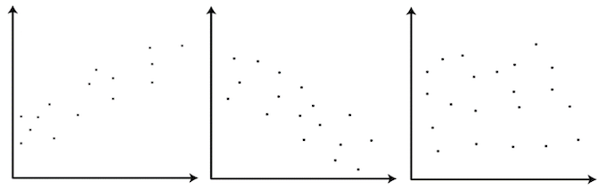
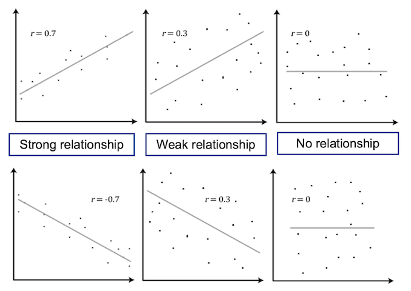
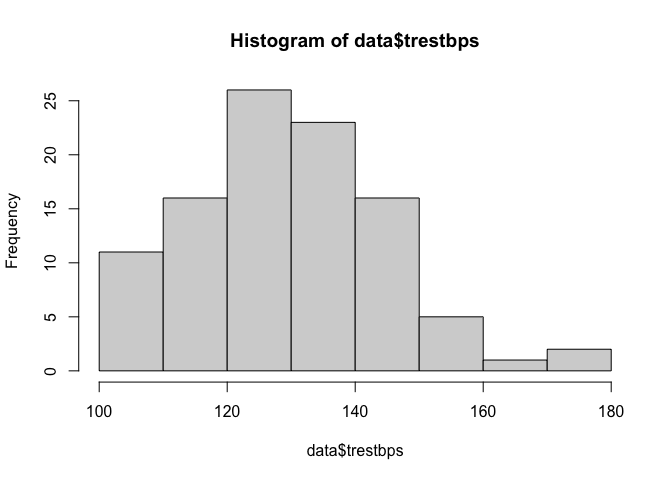
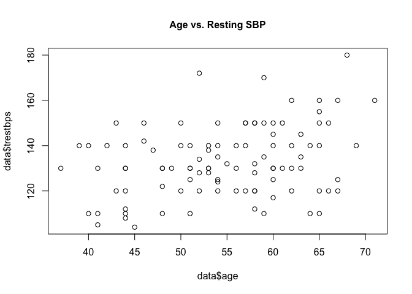
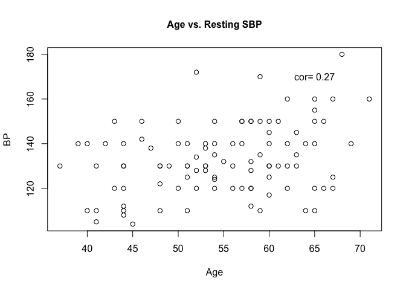
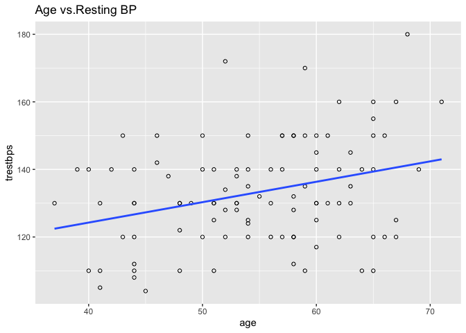
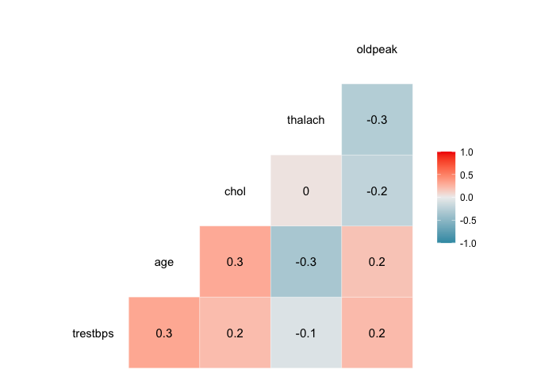
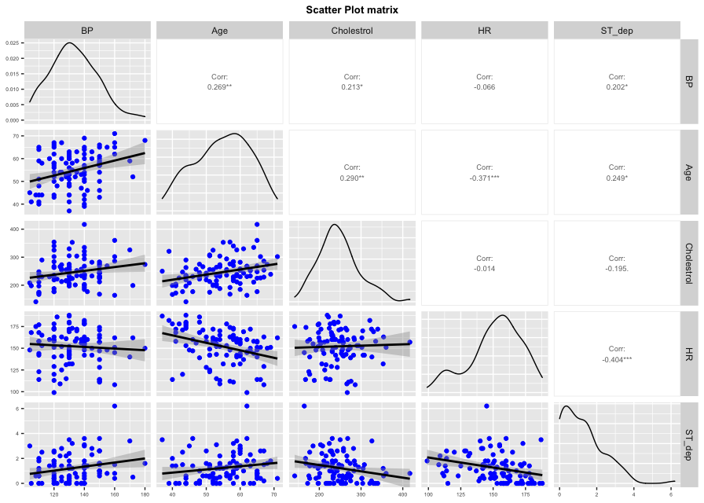

---
# Please do not edit this file directly; it is auto generated.
# Instead, please edit 02-Correlation.md in _episodes_rmd/
title: "Correlation"
teaching: 45
exercises: 10
questions:
- "How can we tell if two variables are correlated?"
- "What test(s) do we use to test for correlation?"
objectives:
- "Test the correlation between a number of variables in our data set."
- "Learn how to determine which test to use, depending on the types of the variables."
keypoints:
-
output: html_document
---

<script
  src = "https://cdn.mathjax.org/mathjax/latest/MathJax.js?config=TeX-AMS-MML_HTMLorMML"
  type = "text/javascript">
</script>


## Introduction

Correlation describes the degree of association between two variables and is most commonly used to measure the extent to which two variables are linear related.

Associations can be positive, where an **increase** in one variable is associated with an **increase** in the other, or negative, where an **increase** in one variable is associated with a **decrease** in the other.

> ## Challenge 1
>
> Label the following three scatter plots as showing no correlation or a positive or negative correlation
>
> 
>
> > ## Solution to Challenge 1
> >
> > * Left image: Positive correlation
> > * Middle image: Negative correlation
> > * Right image: No correlation
> {: .solution}
{: .challenge}

There are different tests for measuring correlation, depending on the distribution of those variables:

* Pearson’s correlation coefficient: Used for the correlation between two continuous and normally distributed variables
* Spearman’s rank test: Used for the correlation between two continuous variables where at least one is non-normally distributed
* Kendall's Tau: Used for the correlation between two ordinal (non-continuous) variables.

### Correlation R Functions

Two R functions for measuring and testing the significance of association are `cor` and `cor.test`, where the correlation coefficient to be computed can be specified as an argument to the function (either "pearson" (default), "spearman", "kendall"). `cor` simply computes the correlation coefficient, while `cor.test` also computes the statistical significance of the computed correlation coefficient.

### Pearson's correlation coefficient

The Pearson's correlation coefficient (_r_) is defined as

$$ r = \frac{\sum_i (x_i - \bar x)(y_i - \bar y)}{\sqrt{\sum_i (x_i - \bar x)^2(y_i - \bar y)^2}} $$

and varies between -1 and 1, where 1 indicates a perfect positive linear relationship and -1 indicates a perfect negative linear relationship. Here, $$\bar{x}$$ is the mean of all values of x.

A common interpretation of the value of _r_ is described in the table below

|Value of _r_        | Relationship
|--------            | -----------
|\|r\| = 0 |No relationship|
|\|r\| = 1 |Perfect **linear** relationship|
|\|r\| < 0.3 | Weak relationship|
|0.3 ≤ \|r\| ≤ 0.7  | Moderate relationship|
|\|r\| = 0.7 | Strong relationship|

### Coefficient of determination

Pearson's $$r$$ can be squared to give us $$r^2$$, the coefficient of determination, which indicates the proportion of variability in one of the variables that can be accounted for by the variability in the second variable.

For example, the if two variables X and Y have a Pearson’s correlation coefficient of _r_ = -0.7, then the coefficient of determination is $$r^2$$ = 0.49. Thus, 49% of the variability in variable X is determined by the variability of variable Y.

## Visualising Relationships

Scatter plots are useful for displaying the relationship between two numerical variables, where each point on the plot represents the value of the two variables for a single observation.
This is useful in the exploratory phase of data analysis to visually determine if a linear relationship is present.

The figure below shows a scatter plot of variables with different levels of correlation.



## Exercise - Correlation Analysis

For the first exercise we will test for correlation between age and resting systolic blood pressure.
The steps for conducting correlation are:

1. Testing for normality: before performing a correlation test, we will look at normality of variables to decide if we are going to use a parametric or non parametric test.
2. Choosing and performing the correct test.
3. Interpreting the analysis results.

### Testing for Normality

Normality can be tested by:

* Visualising the data through a histogram, and
* Conducting Shapiro-Wilk's test.

We can produce a histogram for a numerical variable using the `hist` function.


```r
hist(heart$trestbps)
```


It appears that the variable could potentially be normally distributed, although slightly skewed, but we should analytically test this assumption.
We can perform a Shapiro-Wilk normality test for this variable using the `shapiro.test` function.


```r
shapiro.test(heart$trestbps)
```

~~~
##
## 	Shapiro-Wilk normality test
##
## data:  heart$trestbps
## W = 0.96928, p-value = 0.01947
~~~
{: .output}

The null hypothesis of the Shapiro-Wilk normality test is that the data comes from a normal distribution.
The p-value resulting from this test is significant and so we can reject the null hypothesis that the data is normally distributed
and infer that it is not normally distributed.

### Selecting and Performing the Correct Test

Because our data is continuous but not normally distributed, we will estimate the correlation between SBP and age using a
non-parametric test: Spearman's rank test. The correlation between SBP and age can be estimated using the `cor` function. Here,
we round the result to 2 decimal places and assign it to the `correlation` variable to be used later.


```r
correlation <- round(cor(heart$trestbps, heart$age, method = "spearman"), 2)
```

Further, we can test the significance of this finding using the `cor.test` function.


```r
cor.test(heart$trestbps, heart$age, method = "spearman")
```

~~~
##
## 	Spearman's rank correlation rho
##
## data:  heart$trestbps and heart$age
## S = 121895, p-value = 0.0069
## alternative hypothesis: true rho is not equal to 0
## sample estimates:
##       rho
## 0.2685589
~~~
{: .output}

### Interpreting the Analysis Results

The null hypothesis for this test is that there is no correlation (rho = 0), and the alternative hypothesis is that there is
a correlation (rho is not equal to 0). The resulting p-value for this test is 0.0069, and therefore there is significant
evidence that there is moderate correlation between Age and resting SBP level.

Plotting age and resting SBP on a scatter plot can help us visually understand the association.


```r
plot(heart$trestbps ~ heart$age, main = "Age vs. Resting SBP", cex.main = 1)
```



Additional arguments can be given to the plot function to customise the look and labels of the plot.


```r
plot(heart$trestbps ~ heart$age,
     main = "Age vs. Resting SBP",
     cex.main = 1,
     cex.lab = 1,
     xlab = "Age",
     ylab = "BP",
     cex = 1,
     pch = 1)

text(x = 65,
     y = 170,
     label = paste("cor = ", correlation))
```


The arguments we supplied to the `plot` function are

* main: Main title
* xlab: X axis label
* ylab: Y axis label
* cex: How much the text (titles, axis labels etc.) should be scaled relative to the default (1).
* cex.main: Scaling factor of the main title relative to cex
* cex.lab: Scaling factor of the axis labels relative to cex
* pch: Number representing the symbol to be used (list symbols available in the R docs).

We also used the `text` function to insert the correlation value we computed earlier into the image.

ggplot2 is a popular data visualisation package that offers an elegant framework for creating plots.
We can use geom_point to create a scatter plot and geom_smooth to add a linear least squares regression line to the data.


```r
library(ggplot2)
ggplot(heart, aes(x = age, y = trestbps)) +
  geom_point(shape = 1) +
  geom_smooth(method = lm, se = F)+
  ggtitle("Age vs.Resting BP")
```


Calling `ggplot2()` initialises a ggplot object.
We use this to declare the data frame that contains the data we want to visualise as well as a plot aesthetic (`aes`).
A plot aesthetic is a mapping between a visual cue and a variable.
In our example, we specify that age is to be on the x-axis and resting SBP on the y-axis.
The specified plot aesthetic will be used in all subsequent layers unless specifically overridden.
We then add `geom_point` and `geom_smooth` layers to the plot, as well as a title layer.

## Exploring Relationship Between SBP and Other Continuous Variables

> ## Challenge 2
>
> 1. Test for a correlation between SBP and Cholesterol; can we be confident in this estimate?
> 2. Plot the relationship between these two variables on a scatter plot.
> 3. Does the resulting plot match the results of our
>
> > ## Solution to Challenge 2
> >
> > As we are confident SBP is not normally distributed, we will again use Spearman's rank to determine the correlation.
> >
> >
> > ```r
> > cor.test(heart$trestbps, heart$chol, method = "spearman")
> > ```
> >
> > This shows we have a weak correlation, and the p-value suggests we are confident in this statement.
> > Plotting the data shows
> >
> >
> > ```r
> > plot(heart$trestbps ~ heart$chol, main = "Cholesterol vs. Resting SBP", cex.main = 1)
> > ```
> {: .solution}
{: .challenge}

Instead of running an individual test for each variable, we can test for multiple at a time by indexing the relevant columns of the `heart` data frame.

However, we will first separately analyse the 'ca' variable, the number of major vessels coloured by fluoroscopy, as this is an
ordinal variable, which requires we use Kendall's Tau to measure correlation.


```r
round(cor(heart$trestbps, heart$ca, method = "kendall"), 2)
```

~~~
## [1] -0.05
~~~
{: .output}

```r
cor.test(heart$trestbps, heart$ca, method = "kendall")
```

~~~
##
## 	Kendall's rank correlation tau
##
## data:  heart$trestbps and heart$ca
## z = -0.5971, p-value = 0.5504
## alternative hypothesis: true tau is not equal to 0
## sample estimates:
##         tau
## -0.04876231
~~~
{: .output}

We can obtain a vector indexing the numeric variables in our dataset using a combination of functions in a single line.
We will exclude the 12th column as this is the 'ca' column.


```r
mydata <- heart[-c(12)]

cont <- as.vector(which(sapply(mydata, is.numeric)))
```

Let's break this one-liner down:

`is.numeric(x)` returns `TRUE` if the input x is a numerical value, such as 2 or 62.14, and `FALSE` for all other types, such as factors or strings.
`sapply(list, function)` applies the function argument to each item in the list argument.
So, `sapply(heart, is.numeric)` will return a list of `TRUE` or `FALSE` denoting whether each column (or variable) of our data is numeric.
`which(x)` returns a list of the `TRUE` indices in a logical vector (a vector of only `TRUE` or `FALSE`).

So the result of our one-liner above will be a vector containing the column numbers of the variables that our numerical in our data set.

We can grab the data under each of these variables using our `cont` vector and test the correlation of each our numeric variables with BPS using Pearson’s correlation coefficient.


```r
round(cor(mydata$trestbps, mydata[, cont], method = "spearman", use = "pairwise.complete.obs"), 2)
```

~~~
##       age chol thalach trestbps oldpeak
## [1,] 0.27 0.21   -0.07        1     0.2
~~~
{: .output}

The correlation between BPS and BPS is 1, as this "relationship" is completely linear.

We can visualise the correlation between each pair of variables using `ggcor`, from the `GGally` package.


```r
myvars <- c("trestbps", "age", "chol", "thalach", "oldpeak")
newdata <- heart[myvars]
```

```r
library(GGally)
ggcorr(newdata, palette = "RdBu", label = TRUE)
```


`ggpairs` plots a scatter plot with the correlation for each pair of variables; it also plots an estimated distribution for each variable.


```r
ggpairs(newdata, columns = 1:5, columnLabels = c("BP", "Age", "Cholestrol", "HR", "ST_dep"),
        lower = list(continuous = wrap( "smooth", colour = "blue")), upper = list(continuous = wrap("cor", method = "spearman", size = 2.5))) +
  ggtitle("Scatter Plot matrix") +
  theme(axis.text = element_text(size = 5),
        axis.title = element_text(size = 5),
        plot.title = element_text(size = 10, face = "bold", hjust = 0.5))
```

