---
# Please do not edit this file directly; it is auto generated.
# Instead, please edit 04-Multiple-Linear-Regression.md in _episodes_rmd/
title: "Multiple Linear Regression"
teaching: 45
exercises: 10
questions:
- "What is multiple linear regression?"
- "What are the additional assumptions we need to meet to use multiple linear regression?"
- "How do I perform multiple linear regression in R?"
- "How do I ensure that my data meets the model assumptions?"
objectives:
- "Extend our theory of simple linear regression to multiple linear regression."
- "Use multiple linear regression on our dataset."
- "Check the model diagnostics to ensure the data meets the assumptions of multiple linear regression."
keypoints:
-
output: html_document
---

<script
  src = "https://cdn.mathjax.org/mathjax/latest/MathJax.js?config=TeX-AMS-MML_HTMLorMML"
  type = "text/javascript">
</script>


In simple linear regression, we want to test the effect of one independent variable on one dependent variable.
Multiple linear regression is an extension of simple linear regression and allows for multiple independent variables to predict the dependent variable.

Our simple linear regression model of cigarettes and coronary heart disease gave us that 50% of the variance in CHD could be explained by cigarette smoking.
What about the other 50%? Maybe exercise or cholesterol?

As an extension of simple linear regression, the multiple linear regression model is very similar.
If we have $$p$$ independent variables, then our model is $$ Y = a + b_1 X_1 + b_2 X_2 + \cdots + b_p X_p + e $$ where

* $$Y$$ is the dependent or outcome variable
* $$a$$ is again the estimated Y-intercept
* $$X_i$$ is the value of the $$i$$<sup>th</sup> independent variable
* $$b_i$$ is the estimated regression coefficient (effect size) of the $$i$$<sup>th</sup> independent variable
* $$e$$ is the residual term.

Here, $$Y$$ is a continuous variable and the independent variables $$X_i$$ are either continuous or a binary value.

Each regression coefficient is the amount of change in the outcome variable that would be expected per one-unit change of the predictor, if all other variables in the model were held constant

Multivariable analysis can be used to control for confounder effects (e.g. to adjust for age), to test for interactions between predictors and to improve prediction.

## Model Assumptions

Along with a few familiar assumptions from multiple regression (normality of residuals, homoscedasticity of residuals, outliers), there are a number of new assumptions to account for multiple independent variables.

### Sample Size

The sample size should be at least 10 or 20 times the number of independent variables ($$n >> p$$) otherwise the estimates of the regression are unstable.

### Multicollinearity

If two (independent) variables are closely related it is difficult to estimate their regression coefficients because they will both have a similar effect on the outcome.
This difficulty is called collinearity.
The solution to this problem is to exclude one of the highly correlated variables.

### Overfitting

Related to our sample size assumption, in multivariable modeling, you can get highly significant but meaningless results if you put too many predictors in the model compared to the number of samples.
This is known as overfitting, where the model is fit perfectly to the quirks of your particular sample, but has no predictive ability in a new sample.
A common approach that controls over fitting by keeping the number of predictors to a minimum is step-wise multiple regression:

We start with the one predictor that explains the most predicted variance (i.e. has the highest correlation coefficient with the outcome). Next, the most statistically significant predictors is to the model. The process is repeated until no remaining predictor has a statistically significant correlation with the outcome.

Similarly to simple linear regression, the coefficient of determination ($$R^2$$) indicates the percent of variance in the dependant variable explained by combined effects of the independent variables.
The adjusted $$R^2$$ is used for estimating explained variance in a population (not just the sample) when the sample size is small.

### Outliers

Outliers are observations with extreme values that differ greatly from the rest of your sample.

Even a few outliers can dramatically change estimates of the slope, $$b$$.

The figure below shows an example dataset with an outlier.

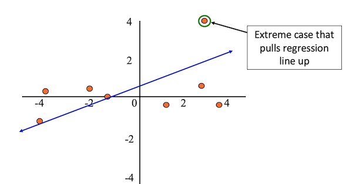

After removing the outlier from the sample, the regression line better fits the rest of the data.

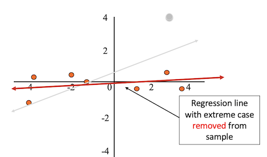

Outliers can result from:

* Errors in coding or data entry (rectify the observation)
* Impossible values in real life (remove the observation)
* Or, sometimes they reflect important “real” variation (include - run the analysis both with and without the observation)

If you see no reason why your outliers are erroneous measurements, then there is no truly objective way to remove them.

## Example - Does ignoring problems and not worrying predict psychological distress?

*Neill (2001)*

Here, we will look into an example in the literature, where two predictor variables: "ignoring problems" and "not worrying" were used in a multiple linear regression model to predict psychological distress. The study design is:

* $$n = 224$$ participants (Australian adolescent population)
* $$Y$$: Measure of psychological distress (low scores indicated a high level of psychological distress)
* $$X_1$$: Not worrying (score based on items)
* $$X_2$$: Ignoring problems (score based on items)

Our model is:

$$ \text{PsychDistress} = a + b_1 \times (\text{NotWorrying}) + b_2 \times (\text{IgnoringProblems}) $$

### Correlations

The figure below shows the correlations between the three variables being assessed.
We can see that the correlation between the independent variables is low (0.352), suggesting that multicollinearity may not be present in this data set.
The correlations between the independent and dependent variables are negative (-0.521 and -0.325).

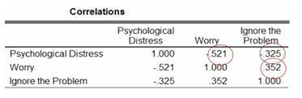

### Model Summary and Coefficients

The figure below shows the $$R$$, $$R^2$$ and Adjusted $$R^2$$ values after fitting the model.
We have $$R^2 = 0.295$$, which indicates that, under our model, approximately 30% of the variance in psychological distress can be attributed to the combined effects of ignoring the problem and not worrying.

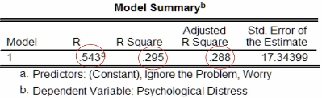

The estimated coefficients of the model is shown in the figure below.

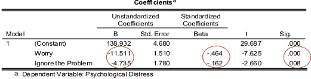

On the right hand side of the table we can see the p-value of each estimate

For each estimated effect, we wish to ask: Is there a linear relationship between each variable $$X_i$$ and $$Y$$?
The hypotheses for these tests are:

* $$H_0$$: $$b_i = 0$$ (no linear relationship)
* $$H_1$$: $$b_i \neq 0$$ (linear relationship between $$X_i$$ and $$Y$$)

We can see from the coefficients table that all estimates are highly significant.

The unstandardised coefficients give us our values of $$a = 138.93$$, $$b_1 = -11.51$$ and $$b_2 = -4.74$$, and so our model is

$$ \text{PsychDistress} = 138.93 - 11.51 \times (\text{NotWorrying}) - 4.74 \times (\text{IgnoringProblems}) $$

We can make some interpretations of the model using these estimates:

* When the score of not worrying and ignoring problems are both zero, then the psychological distress score is 138.93.
* When the score of ignoring problems is held constant, each unit increase in the score of not worrying decreases the psychological distress score by 11.51 units.
* When the score of not worring is held constant, each unit increase in the score of ignoring problems decreases the psychological distress score by 4.71 units.

The standardised coefficients (Beta) are calculated using the unstandardised coefficients and their respective standard error.
These values allow us to compare the relative effect size of the predictor variables; here, we see that not worrying has a relatively larger (negative) effect size.

The figure below gives 95% confidence intervals for the intercept term and the standardised coefficients.
We can interpret these intervals as: we can be 95% confident that the interval captures the true value of the estimate.

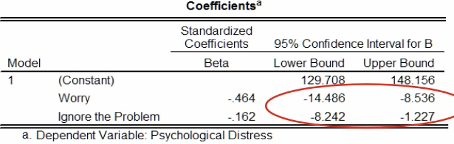


## Non-linear Models

Linear Regression fits a straight line to your data, but in some cases a non-linear model may be more appropriate, such as logistic or cox regression.
Non-linear models are usually used when non-linear relationships have some biological explanation.

### Examples of Non-linear Models

Examples of different multivariate regression models are shown in the table below.

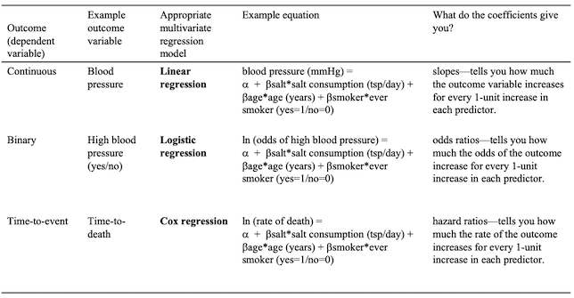

## Summary

In summary, choose simple linear regression when you are predicting a continuous variable with one predictor variable, and choose multiple linear regression when predicting with more than one predictor variable.

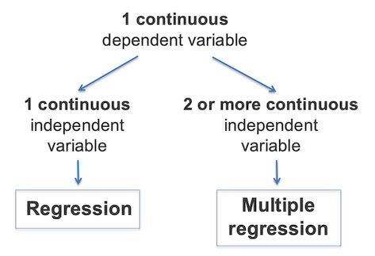

## Exercise 1 - Identify potential predictors of Systolic Blood Pressure

### Step 1: Checking for correlations

First, we will check for correlations between our variables of interest.


```r
n = c("trestbps", "age", "chol", "thalach")
round(cor(heart[, n], method = "spearman", use = "pairwise.complete.obs"), 2)
```

~~~
##          trestbps   age  chol thalach
## trestbps     1.00  0.27  0.21   -0.07
## age          0.27  1.00  0.29   -0.37
## chol         0.21  0.29  1.00   -0.01
## thalach     -0.07 -0.37 -0.01    1.00
~~~

Here we observe that age and cholesterol have the highest correlations with SBP, and there are no high correlations within the predictor variables.

### Step 2: Identifying potential predictors

Next, we will identify potential predictors of SBP in univariable linear regressions (i.e, SBP vs. each predictor). We can check this manually one-by-one, or in a loop.

We can manually fit a simple linear regression model for each predictor variable, with SBP as the dependent variable, and check the significance of the relationship to determine if the predictor variable should be included in the multivariable model.
The example below does so for the age variable.


```r
i <- "age"
anova(lm(heart$trestbps ~ heart[, i]))
```

~~~
## Analysis of Variance Table
##
## Response: heart$trestbps
##            Df  Sum Sq Mean Sq F value   Pr(>F)
## heart[, i]  1  2380.9 2380.91   10.83 0.001389 **
## Residuals  98 21544.5  219.84
## ---
## Signif. codes:  0 '***' 0.001 '**' 0.01 '*' 0.05 '.' 0.1 ' ' 1
~~~

```r
summary(lm(heart$trestbps ~ heart[, i]))
```

~~~
##
## Call:
## lm(formula = heart$trestbps ~ heart[, i])
##
## Residuals:
##     Min      1Q  Median      3Q     Max
## -29.362 -11.385  -0.823  10.185  40.489
##
## Coefficients:
##             Estimate Std. Error t value Pr(>|t|)
## (Intercept) 100.1066    10.1527   9.860 2.44e-16 ***
## heart[, i]    0.6039     0.1835   3.291  0.00139 **
## ---
## Signif. codes:  0 '***' 0.001 '**' 0.01 '*' 0.05 '.' 0.1 ' ' 1
##
## Residual standard error: 14.83 on 98 degrees of freedom
## Multiple R-squared:  0.09951,	Adjusted R-squared:  0.09033
## F-statistic: 10.83 on 1 and 98 DF,  p-value: 0.001389
~~~

A more advanced and efficient method would be to perform these checks in a loop.


```r
result_LM <- c()
N <- c(2:6)
for(i in N) {
  res <- lm(heart$trestbps ~ heart[, i])
  result_LM[i] <- anova(res)$`Pr(>F)`[1]
}
signfic_res_or_close <- colnames(heart)[which(result_LM < 0.2)]

print(signfic_res_or_close)
```

~~~
## [1] "age"  "sex"  "chol" "fbs"
~~~

Next, we will create a new dataset containing the predictors of interest along with the SBP and ID data using the `signfic_res_or_close` vector we just created.


```r
newdataset <- heart[, c("ID", "trestbps", signfic_res_or_close)] # create a new dataset only containing the data we will use in the model
rownames(newdataset) <- newdataset$ID # set the row names to be the ID of the observations
newdataset <- newdataset[, -1] # remove the ID column from the data
```

### Step 3: Fitting the model

Now we will fit the multiple linear regression model on the data of interest, using the same `lm` function from simple linear regression, and print the summary of the model.


```r
result <- lm(trestbps ~ ., data = newdataset)
anova(result)
```

~~~
## Analysis of Variance Table
##
## Response: trestbps
##           Df  Sum Sq Mean Sq F value   Pr(>F)
## age        1  2380.9 2380.91 11.2843 0.001126 **
## sex        1   264.5  264.51  1.2537 0.265678
## chol       1   268.5  268.47  1.2724 0.262159
## fbs        1   967.2  967.17  4.5839 0.034833 *
## Residuals 95 20044.4  210.99
## ---
## Signif. codes:  0 '***' 0.001 '**' 0.01 '*' 0.05 '.' 0.1 ' ' 1
~~~

```r
summary(result)
```

~~~
##
## Call:
## lm(formula = trestbps ~ ., data = newdataset)
##
## Residuals:
##     Min      1Q  Median      3Q     Max
## -25.385 -11.319  -1.913  10.158  34.460
##
## Coefficients:
##              Estimate Std. Error t value Pr(>|t|)
## (Intercept) 102.26977   12.09094   8.458 3.23e-13 ***
## age           0.42890    0.19344   2.217   0.0290 *
## sexMale      -3.43855    3.31865  -1.036   0.3028
## chol          0.03498    0.03189   1.097   0.2754
## fbs>120       9.49559    4.43511   2.141   0.0348 *
## ---
## Signif. codes:  0 '***' 0.001 '**' 0.01 '*' 0.05 '.' 0.1 ' ' 1
##
## Residual standard error: 14.53 on 95 degrees of freedom
## Multiple R-squared:  0.1622,	Adjusted R-squared:  0.1269
## F-statistic: 4.599 on 4 and 95 DF,  p-value: 0.001943
~~~

The adjusted $$R^2$$ is approximately 0.13, indicating that 13% of the variability in SBP is explained by the combination of all the independent variables included in the model.
However, we can see that sex and cholesterol are not significant.
We will use step-wise elimination to obtain a better model by removing a variable one-by-one.

One option is using the Akaike information criterion (AIC) to determine which model is best for the dataset. We can use `step` to do so.


```r
step(result, direction = "backward") #Base R
```

~~~
## Start:  AIC=540.05
## trestbps ~ age + sex + chol + fbs
##
##        Df Sum of Sq   RSS    AIC
## - sex   1    226.51 20271 539.18
## - chol  1    253.92 20298 539.31
## <none>              20044 540.05
## - fbs   1    967.17 21012 542.77
## - age   1   1037.31 21082 543.10
##
## Step:  AIC=539.18
## trestbps ~ age + chol + fbs
##
##        Df Sum of Sq   RSS    AIC
## - chol  1    381.24 20652 539.04
## <none>              20271 539.18
## - fbs   1    896.27 21167 541.50
## - age   1   1135.49 21406 542.63
##
## Step:  AIC=539.04
## trestbps ~ age + fbs
##
##        Df Sum of Sq   RSS    AIC
## <none>              20652 539.04
## - fbs   1    892.39 21544 541.27
## - age   1   1711.17 22363 545.00
##
## Call:
## lm(formula = trestbps ~ age + fbs, data = newdataset)
##
## Coefficients:
## (Intercept)          age      fbs>120
##    103.3074       0.5239       9.0886
~~~

Alternatively, we can use the `MASS` library's `stepAIC` function.


```r
library(MASS)
stepAIC(result, direction = "backward") #library MASS
```

~~~
## Start:  AIC=540.05
## trestbps ~ age + sex + chol + fbs
##
##        Df Sum of Sq   RSS    AIC
## - sex   1    226.51 20271 539.18
## - chol  1    253.92 20298 539.31
## <none>              20044 540.05
## - fbs   1    967.17 21012 542.77
## - age   1   1037.31 21082 543.10
##
## Step:  AIC=539.18
## trestbps ~ age + chol + fbs
##
##        Df Sum of Sq   RSS    AIC
## - chol  1    381.24 20652 539.04
## <none>              20271 539.18
## - fbs   1    896.27 21167 541.50
## - age   1   1135.49 21406 542.63
##
## Step:  AIC=539.04
## trestbps ~ age + fbs
##
##        Df Sum of Sq   RSS    AIC
## <none>              20652 539.04
## - fbs   1    892.39 21544 541.27
## - age   1   1711.17 22363 545.00
##
## Call:
## lm(formula = trestbps ~ age + fbs, data = newdataset)
##
## Coefficients:
## (Intercept)          age      fbs>120
##    103.3074       0.5239       9.0886
~~~

In both functions, the call of the final model is outputted. Let's have a look at the summary.


```r
finalmodel <- lm(trestbps ~ age + fbs, data = newdataset)
summary(finalmodel)
```

~~~
##
## Call:
## lm(formula = trestbps ~ age + fbs, data = newdataset)
##
## Residuals:
##    Min     1Q Median     3Q    Max
## -27.36 -10.81  -0.14  10.12  35.78
##
## Coefficients:
##             Estimate Std. Error t value Pr(>|t|)
## (Intercept) 103.3074    10.1129  10.215  < 2e-16 ***
## age           0.5239     0.1848   2.835  0.00558 **
## fbs>120       9.0886     4.4393   2.047  0.04333 *
## ---
## Signif. codes:  0 '***' 0.001 '**' 0.01 '*' 0.05 '.' 0.1 ' ' 1
##
## Residual standard error: 14.59 on 97 degrees of freedom
## Multiple R-squared:  0.1368,	Adjusted R-squared:  0.119
## F-statistic: 7.687 on 2 and 97 DF,  p-value: 0.0007963
~~~

Now, with all estimates significant, we can make some interpretations:

* SBP increases by 0.52 units for every unit increase of age when all other variables in the model are kept constant.
* SBP is estimated to be 9.90 units higher for participants with fbs > 120 than those with fbs < 120 when all other variables in the model are kept constant.

However, we still need to check the assumptions of a multiple linear regression model are met before using the model.

### Step 4: Checking the assumptions


```r
par(mfrow = c(2, 2))
plot(finalmodel)
```
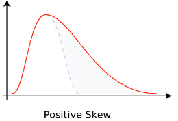

Here, we observe that the variance of the residuals seems constant and the distribution of the residuals appears to be normal.
To measure multicolinearity, we can use the `vif` function from the `car` package.
VIF measures how much the variance of any one of the coefficients is inflated due to multicollinearity in the overall model.
As a rule of thumb, any value above 5 is a cause for concern.


```r
library(car)
car::vif(finalmodel)
```

~~~
##    age    fbs
## 1.0469 1.0469
~~~

There appears to be no evidence of colinearity, and so we can conclude that the assumptions of the model are met.

### Another approach - _a priori_ selection of variables.

An alternative approach is to simply include all variables determined to be important.

First, we select all variables of interest and fit the model.


```r
selection <- c("ID", "age", "sex", "chol", "trestbps", "fbs", "thalach")

select_data <- heart[, selection]
rownames(select_data) <- select_data$ID
select_data <- select_data[,-1]

result2 <- lm(trestbps ~ ., data = select_data) # . means add all variables except for the specified dependent variable
anova(result2)
```

~~~
## Analysis of Variance Table
##
## Response: trestbps
##           Df  Sum Sq Mean Sq F value   Pr(>F)
## age        1  2380.9 2380.91 11.1687 0.001195 **
## sex        1   264.5  264.51  1.2408 0.268154
## chol       1   268.5  268.47  1.2594 0.264630
## fbs        1   967.2  967.17  4.5370 0.035782 *
## thalach    1     5.8    5.80  0.0272 0.869319
## Residuals 94 20038.6  213.18
## ---
## Signif. codes:  0 '***' 0.001 '**' 0.01 '*' 0.05 '.' 0.1 ' ' 1
~~~

```r
summary(result2)
```

~~~
##
## Call:
## lm(formula = trestbps ~ ., data = select_data)
##
## Residuals:
##     Min      1Q  Median      3Q     Max
## -25.140 -11.395  -1.931  10.165  34.450
##
## Coefficients:
##              Estimate Std. Error t value Pr(>|t|)
## (Intercept) 104.85347   19.82376   5.289 7.98e-07 ***
## age           0.41491    0.21213   1.956   0.0534 .
## sexMale      -3.47769    3.34420  -1.040   0.3010
## chol          0.03574    0.03238   1.104   0.2725
## fbs>120       9.60786    4.50964   2.131   0.0357 *
## thalach      -0.01310    0.07941  -0.165   0.8693
## ---
## Signif. codes:  0 '***' 0.001 '**' 0.01 '*' 0.05 '.' 0.1 ' ' 1
##
## Residual standard error: 14.6 on 94 degrees of freedom
## Multiple R-squared:  0.1625,	Adjusted R-squared:  0.1179
## F-statistic: 3.647 on 5 and 94 DF,  p-value: 0.004644
~~~

The interpretation of the model estimates are:

* SBP level equals 104.9 mmHg when all the other variables in the model equal zero (note: this doesn't make sense in real life given the nature of the variables)
* SBP increases by 0.41 units for each unit increase of age
* SBP level is 9.6 units higher in patients with fbs greater than 120 as compared to those with fbs less than 120 units.

As always, we must check the assumptions of the model.
First, we look at multicolinearity.


```r
car::vif(result2)
```

~~~
##      age      sex     chol      fbs  thalach
## 1.377895 1.080196 1.175630 1.078965 1.196628
~~~

As there are no values above 5, there appears to be no evidence of multicolinearity.

Next, we check the other assumptions.


```r
par(mfrow = c(2, 2))
plot(result2)
```

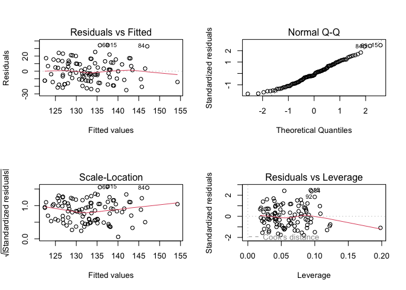

The variance of the residuals appears constant and the distribution of the residuals appear normal.
However, despite adding more variables, this model explains 12% variability ($$R^2 = 0.117$$) in the outcome as compared to 13% from the other model.
Some variables that had significant effect in the other model are now insignificant (age, sex), which limits the interpretability of the model.

A more robust approach, such as stepwise or lasso regression, could be used to select the final model.

## Exercise 2 - Identifying potential predictors of plasma beta-carotene level

Data not published yet but a related reference is:
*Nierenberg DW, Stukel TA, Baron JA, Dain BJ, Greenberg ER. Determinants of plasma levels of beta-carotene and retinol. American Journal of Epidemiology 1989;130:511-521*

For this exercise, we will use multiple linear regression to identify determinants of plasma beta-carotene levels.
The data we will use is from a cross-sectional study investigating the relationship between personal characteristics and dietary factors, and plasma concentrations of beta-carotene.
This study observed 315 patients who had a surgical procedure to remove a non-cancerous lesion of the lung, colon, breast, skin, ovary or uterus.

Variable    | Description
--------    | ------------
age         | Age (years)
sex         | Sex (1 = male, 2 = female)
smokstat    | Smoking status (1 = never, 2 = former, 3 = current Smoker)
quetelet    | Quetelet (weight/height<sup>2</sup>)
vituse      | Vitamin use (1 = yes, fairly often, 2 = yes, not often, 3 = no)
calories    | Number of calories consumed per day
fat         | Grams of fat consumed per day
fiber       | Grams of fiber consumed per day
alcohol     | Number of alcoholic drinks consumed per week
cholesterol | Cholestoral consumed (mg per day)
betadiet    | Dietary beta-carotene consumed (µg per day)
retdiet     | Dietary retinol consumed (µg per day)
betaplasma  | Plasma beta-carotene (ng/ml)
retplasma   | Plasma retinol (ng/ml)

### Importing and cleaning the data

First, we will import the data and use the `str` function to check its coding.


```r
plasma <- read.csv("data/plasma.csv", stringsAsFactors = TRUE)
str(plasma)
```

~~~
## 'data.frame':	315 obs. of  15 variables:
##  $ Patient.ID : int  1 2 3 4 5 6 7 8 9 10 ...
##  $ age        : int  64 76 38 40 72 40 65 58 35 55 ...
##  $ sex        : int  2 2 2 2 2 2 2 2 2 2 ...
##  $ smokstat   : int  2 1 2 2 1 2 1 1 1 2 ...
##  $ quetelet   : num  21.5 23.9 20 25.1 21 ...
##  $ vituse     : int  1 1 2 3 1 3 2 1 3 3 ...
##  $ calories   : num  1299 1032 2372 2450 1952 ...
##  $ fat        : num  57 50.1 83.6 97.5 82.6 56 52 63.4 57.8 39.6 ...
##  $ fiber      : num  6.3 15.8 19.1 26.5 16.2 9.6 28.7 10.9 20.3 15.5 ...
##  $ alcohol    : num  0 0 14.1 0.5 0 1.3 0 0 0.6 0 ...
##  $ cholesterol: num  170.3 75.8 257.9 332.6 170.8 ...
##  $ betadiet   : int  1945 2653 6321 1061 2863 1729 5371 823 2895 3307 ...
##  $ retdiet    : int  890 451 660 864 1209 1439 802 2571 944 493 ...
##  $ betaplasma : int  200 124 328 153 92 148 258 64 218 81 ...
##  $ retplasma  : int  915 727 721 615 799 654 834 825 517 562 ...
~~~

As with our systolic blood pressure example, we have categorical variables being coded as numerical values, and so we will change them to factors.


```r
plasma$Patient.ID <- as.factor(plasma$Patient.ID)
plasma$sex <- as.factor(plasma$sex)
plasma$smokstat <- as.factor(plasma$smokstat)
plasma$vituse <- as.factor(plasma$vituse)
```

To aid in interpreting the model, we will change the levels of the factors, where appropriate.


```r
levels(plasma$sex) <- c("Male", "Female")
levels(plasma$smokstat) <- c("Never", "Former", "Current")
levels(plasma$vituse) <- c("Often", "NotOften", "No")
```

Now we can view a summary of the data with the correct variable types.


```r
summary(plasma)
```

~~~
##    Patient.ID       age            sex         smokstat      quetelet
##  1      :  1   Min.   :19.00   Male  : 42   Never  :157   Min.   :16.33
##  2      :  1   1st Qu.:39.00   Female:273   Former :115   1st Qu.:21.80
##  3      :  1   Median :48.00                Current: 43   Median :24.74
##  4      :  1   Mean   :50.15                              Mean   :26.16
##  5      :  1   3rd Qu.:62.50                              3rd Qu.:28.85
##  6      :  1   Max.   :83.00                              Max.   :50.40
##  (Other):309
##       vituse       calories           fat             fiber
##  Often   :122   Min.   : 445.2   Min.   : 14.40   Min.   : 3.10
##  NotOften: 82   1st Qu.:1338.0   1st Qu.: 53.95   1st Qu.: 9.15
##  No      :111   Median :1666.8   Median : 72.90   Median :12.10
##                 Mean   :1796.7   Mean   : 77.03   Mean   :12.79
##                 3rd Qu.:2100.4   3rd Qu.: 95.25   3rd Qu.:15.60
##                 Max.   :6662.2   Max.   :235.90   Max.   :36.80
##
##     alcohol        cholesterol       betadiet       retdiet
##  Min.   : 0.000   Min.   : 37.7   Min.   : 214   Min.   :  30.0
##  1st Qu.: 0.000   1st Qu.:155.0   1st Qu.:1116   1st Qu.: 480.0
##  Median : 0.300   Median :206.3   Median :1802   Median : 707.0
##  Mean   : 2.643   Mean   :242.5   Mean   :2186   Mean   : 832.7
##  3rd Qu.: 3.200   3rd Qu.:308.9   3rd Qu.:2836   3rd Qu.:1037.0
##  Max.   :35.000   Max.   :900.7   Max.   :9642   Max.   :6901.0
##  NA's   :1
##    betaplasma       retplasma
##  Min.   :   0.0   Min.   : 179.0
##  1st Qu.:  90.0   1st Qu.: 466.0
##  Median : 140.0   Median : 566.0
##  Mean   : 189.9   Mean   : 602.8
##  3rd Qu.: 230.0   3rd Qu.: 716.0
##  Max.   :1415.0   Max.   :1727.0
##
~~~

Let's view a histogram of the plasma beta-carotene variable.


```r
hist(plasma$betaplasma)
```
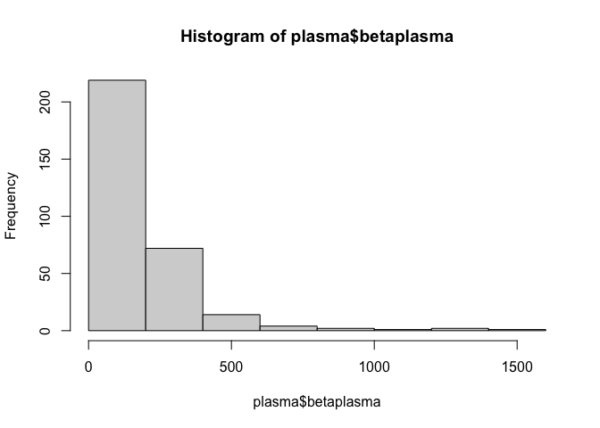

This doesn't appear to be normally distributed, which may affect the performance of our model.
We can check this using the Shapiro-Wilk normality test.


```r
shapiro.test(plasma$betaplasma)
```

~~~
##
## 	Shapiro-Wilk normality test
##
## data:  plasma$betaplasma
## W = 0.66071, p-value < 2.2e-16
~~~

This tiny p-value suggests it is incredibly unlikely that the data is normally distributed.
However, the data is right-skewed, as shown below, which could mean that the data is log-normally distributed.


Under this distribution, the logarithm of the data is normally distributed.

Other transformations include:

* When the data are counts, perform a square-root transformation:

$$ x_{\text{trans}} = \sqrt{x + 1/2} $$

* When data are proportions, perform an arcsine transformation

$$ x_{\text{trans}} = \arcsin(\sqrt{x}) $$

* When frequency distribution of data is left-skewed, perform a square transformation:

$$ x_{\text{trans}} = x^2 $$

Using the `log` function, we will create a new variable for plasma beta-carotene with a log-transformation applied and plot a histogram for this new variable.


```r
plasma$logbetaplasma <- log(plasma$betaplasma + 1)
hist(plasma$logbetaplasma)
```
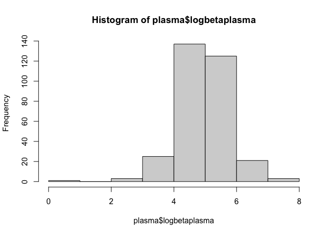


### Checking for correlations

Next, we will check for correlations between beta-carotene and the potential independent variables.


```r
n <- as.vector(which(sapply(plasma, is.numeric)))
cor(plasma$betaplasma, plasma[, n], method = "spearman", use = "pairwise.complete.obs")
```

~~~
##            age   quetelet   calories        fat     fiber    alcohol
## [1,] 0.1596575 -0.2969552 -0.0552741 -0.1311411 0.1890558 0.07566391
##      cholesterol  betadiet    retdiet betaplasma retplasma logbetaplasma
## [1,]   -0.142528 0.1786116 0.02242424          1 0.1306213             1
~~~

Here, we observe quetelet (-), cholesterol (-), betadiet (+) and fiber (+) have the highest correlations with betaplasma.

### Regression with untransformed beta-carotene

As in our previous example, we will identify potential predictors of beta-carotene in univariate linear regression.
As we are now R experts, we will do so using the advanced option!


```r
result_LM <- c()
N <- c(2:13)
for(i in N) {
  res <- lm(plasma$betaplasma ~ plasma[, i])
  result_LM[i] <- anova(res)$`Pr(>F)`[1]
}
signfic_res_or_close <- colnames(plasma)[which(result_LM < 0.2)]

print(signfic_res_or_close)
```

~~~
## [1] "age"         "sex"         "smokstat"    "quetelet"    "vituse"
## [6] "fat"         "fiber"       "cholesterol" "betadiet"
~~~

### Fitting the model

Now that we have the predictor variables of interest, we can fit our initial model.


```r
signif <- c("Patient.ID", "age", "sex", "smokstat", "quetelet", "vituse", "fat", "fiber", "cholesterol", "betadiet")

newdataset <- plasma[ , c(signif, "betaplasma")]
rownames(newdataset) <- newdataset$Patient.ID
newdataset <- newdataset[,-1]

#Conduct multiple linear regression on initially selected variables
initial_result <- lm(betaplasma ~ ., data = newdataset)
summary(initial_result)
```

~~~
##
## Call:
## lm(formula = betaplasma ~ ., data = newdataset)
##
## Residuals:
##     Min      1Q  Median      3Q     Max
## -248.83  -91.86  -28.50   39.52 1074.67
##
## Coefficients:
##                   Estimate Std. Error t value Pr(>|t|)
## (Intercept)     270.244199  80.373812   3.362 0.000872 ***
## age               0.829072   0.714955   1.160 0.247119
## sexFemale        28.924845  31.135740   0.929 0.353633
## smokstatFormer   -4.619008  21.103312  -0.219 0.826894
## smokstatCurrent -44.407926  30.583897  -1.452 0.147535
## quetelet         -6.059352   1.616615  -3.748 0.000213 ***
## vituseNotOften  -33.121372  24.378300  -1.359 0.175271
## vituseNo        -75.123429  22.668202  -3.314 0.001031 **
## fat              -0.294250   0.416752  -0.706 0.480696
## fiber             5.062592   2.139125   2.367 0.018578 *
## cholesterol      -0.101467   0.104350  -0.972 0.331641
## betadiet          0.016869   0.007402   2.279 0.023358 *
## ---
## Signif. codes:  0 '***' 0.001 '**' 0.01 '*' 0.05 '.' 0.1 ' ' 1
##
## Residual standard error: 167.4 on 303 degrees of freedom
## Multiple R-squared:  0.1924,	Adjusted R-squared:  0.163
## F-statistic: 6.561 on 11 and 303 DF,  p-value: 8.048e-10
~~~

We can see that there are many insignificant predictor variables.
To find a better model, we will use backward elimination.


```r
step(initial_result, direction = "backward")
```

~~~
## Start:  AIC=3237.68
## betaplasma ~ age + sex + smokstat + quetelet + vituse + fat +
##     fiber + cholesterol + betadiet
##
##               Df Sum of Sq     RSS    AIC
## - smokstat     2     61227 8554072 3235.9
## - fat          1     13973 8506818 3236.2
## - sex          1     24190 8517035 3236.6
## - cholesterol  1     26502 8519347 3236.7
## - age          1     37691 8530536 3237.1
## <none>                     8492845 3237.7
## - betadiet     1    145589 8638434 3241.0
## - fiber        1    156994 8649839 3241.5
## - vituse       2    308129 8800974 3244.9
## - quetelet     1    393776 8886621 3250.0
##
## Step:  AIC=3235.94
## betaplasma ~ age + sex + quetelet + vituse + fat + fiber + cholesterol +
##     betadiet
##
##               Df Sum of Sq     RSS    AIC
## - fat          1     17973 8572045 3234.6
## - sex          1     29033 8583105 3235.0
## - cholesterol  1     29671 8583743 3235.0
## - age          1     52596 8606668 3235.9
## <none>                     8554072 3235.9
## - betadiet     1    152640 8706712 3239.5
## - fiber        1    193347 8747419 3241.0
## - vituse       2    350499 8904571 3244.6
## - quetelet     1    358772 8912844 3246.9
##
## Step:  AIC=3234.6
## betaplasma ~ age + sex + quetelet + vituse + fiber + cholesterol +
##     betadiet
##
##               Df Sum of Sq     RSS    AIC
## - sex          1     32104 8604149 3233.8
## <none>                     8572045 3234.6
## - age          1     64663 8636707 3235.0
## - cholesterol  1    124969 8697014 3237.2
## - betadiet     1    154279 8726324 3238.2
## - fiber        1    176490 8748535 3239.0
## - vituse       2    356475 8928520 3243.4
## - quetelet     1    356325 8928369 3245.4
##
## Step:  AIC=3233.78
## betaplasma ~ age + quetelet + vituse + fiber + cholesterol +
##     betadiet
##
##               Df Sum of Sq     RSS    AIC
## - age          1     43584 8647733 3233.4
## <none>                     8604149 3233.8
## - betadiet     1    161688 8765836 3237.6
## - fiber        1    173266 8777414 3238.1
## - cholesterol  1    182098 8786247 3238.4
## - vituse       2    396774 9000923 3244.0
## - quetelet     1    351079 8955227 3244.4
##
## Step:  AIC=3233.37
## betaplasma ~ quetelet + vituse + fiber + cholesterol + betadiet
##
##               Df Sum of Sq     RSS    AIC
## <none>                     8647733 3233.4
## - betadiet     1    172718 8820451 3237.6
## - fiber        1    178187 8825920 3237.8
## - cholesterol  1    208138 8855871 3238.9
## - vituse       2    393625 9041358 3243.4
## - quetelet     1    349446 8997179 3243.9
##
## Call:
## lm(formula = betaplasma ~ quetelet + vituse + fiber + cholesterol +
##     betadiet, data = newdataset)
##
## Coefficients:
##    (Intercept)        quetelet  vituseNotOften        vituseNo           fiber
##      318.98140        -5.63336       -39.06075       -83.16795         5.17640
##    cholesterol        betadiet
##       -0.19938         0.01825
~~~

So, our final model uses quetelet, vitamin use, fiber, cholesterol and dietary beta-carotene as the predictor variables.


```r
finalmodel_raw <- lm(formula = betaplasma ~ quetelet + vituse + fiber + cholesterol + betadiet, data = newdataset)
summary(finalmodel_raw)
```

~~~
##
## Call:
## lm(formula = betaplasma ~ quetelet + vituse + fiber + cholesterol +
##     betadiet, data = newdataset)
##
## Residuals:
##     Min      1Q  Median      3Q     Max
## -302.53  -89.27  -26.04   35.89 1075.58
##
## Coefficients:
##                  Estimate Std. Error t value Pr(>|t|)
## (Intercept)    318.981399  51.639159   6.177 2.06e-09 ***
## quetelet        -5.633362   1.596810  -3.528 0.000483 ***
## vituseNotOften -39.060747  24.059922  -1.623 0.105510
## vituseNo       -83.167948  22.213960  -3.744 0.000216 ***
## fiber            5.176397   2.054779   2.519 0.012268 *
## cholesterol     -0.199382   0.073229  -2.723 0.006844 **
## betadiet         0.018248   0.007357   2.480 0.013664 *
## ---
## Signif. codes:  0 '***' 0.001 '**' 0.01 '*' 0.05 '.' 0.1 ' ' 1
##
## Residual standard error: 167.6 on 308 degrees of freedom
## Multiple R-squared:  0.1776,	Adjusted R-squared:  0.1616
## F-statistic: 11.09 on 6 and 308 DF,  p-value: 3.37e-11
~~~

Finally, as always, we will check if the model meets the assumptions of multiple linear regression.


```r
par(mfrow = c(2, 2))
plot(finalmodel_raw)
```


Here, we observe non-constant residual variance and deviation of residuals from normality.
Let's refit a model using the log-transformed plasma beta-carotene.

First, we obtain the significant variables from running seperate univariate linear regression models on each candidate predictor variable.


```r
result_LM <- c()
N <- c(2:13)
for(i in N) {
  res <- lm(plasma$logbetaplasma ~ plasma[, i])
  result_LM[i] <- anova(res)$`Pr(>F)`[1]
}
signfic_res_or_close <- colnames(heart)[which(result_LM < 0.2)]
```

Next, we fit an initial model using the significant variables and then perform backwards elimination to obtain the final model


```r
signif <- c("Patient.ID", "age", "sex", "quetelet", "vituse", "smokstat", "fat", "fiber", "cholesterol", "betadiet")

newdataset <- plasma[ , c(signif, "logbetaplasma")]
rownames(newdataset) <- newdataset$Patient.ID
newdataset <- newdataset[,-1]

#Conduct multiple linear regression on initially selected variables
initial_result <- lm(logbetaplasma ~ ., data = newdataset)
summary(initial_result)
```

~~~
##
## Call:
## lm(formula = logbetaplasma ~ ., data = newdataset)
##
## Residuals:
##     Min      1Q  Median      3Q     Max
## -4.0438 -0.3629  0.0272  0.3968  1.8536
##
## Coefficients:
##                   Estimate Std. Error t value Pr(>|t|)
## (Intercept)      5.408e+00  3.353e-01  16.129  < 2e-16 ***
## age              5.981e-03  2.983e-03   2.005   0.0458 *
## sexFemale        1.506e-01  1.299e-01   1.160   0.2471
## quetelet        -3.230e-02  6.745e-03  -4.788 2.63e-06 ***
## vituseNotOften   2.614e-02  1.017e-01   0.257   0.7973
## vituseNo        -2.425e-01  9.457e-02  -2.564   0.0108 *
## smokstatFormer  -5.665e-02  8.804e-02  -0.643   0.5205
## smokstatCurrent -2.397e-01  1.276e-01  -1.879   0.0612 .
## fat             -8.015e-04  1.739e-03  -0.461   0.6451
## fiber            2.161e-02  8.925e-03   2.421   0.0161 *
## cholesterol     -1.100e-03  4.353e-04  -2.528   0.0120 *
## betadiet         6.548e-05  3.088e-05   2.120   0.0348 *
## ---
## Signif. codes:  0 '***' 0.001 '**' 0.01 '*' 0.05 '.' 0.1 ' ' 1
##
## Residual standard error: 0.6985 on 303 degrees of freedom
## Multiple R-squared:  0.2468,	Adjusted R-squared:  0.2195
## F-statistic: 9.026 on 11 and 303 DF,  p-value: 6.109e-14
~~~

```r
#Backward Elimination
step(initial_result, direction = "backward")
```

~~~
## Start:  AIC=-214.31
## logbetaplasma ~ age + sex + quetelet + vituse + smokstat + fat +
##     fiber + cholesterol + betadiet
##
##               Df Sum of Sq    RSS     AIC
## - fat          1    0.1037 147.93 -216.09
## - sex          1    0.6560 148.48 -214.92
## - smokstat     2    1.7226 149.55 -214.66
## <none>                     147.82 -214.31
## - age          1    1.9618 149.79 -212.16
## - betadiet     1    2.1935 150.02 -211.67
## - fiber        1    2.8597 150.69 -210.28
## - cholesterol  1    3.1172 150.94 -209.74
## - vituse       2    4.3545 152.18 -209.17
## - quetelet     1   11.1863 159.01 -193.33
##
## Step:  AIC=-216.09
## logbetaplasma ~ age + sex + quetelet + vituse + smokstat + fiber +
##     cholesterol + betadiet
##
##               Df Sum of Sq    RSS     AIC
## - sex          1    0.6832 148.61 -216.64
## - smokstat     2    1.7991 149.73 -216.28
## <none>                     147.93 -216.09
## - age          1    2.1465 150.07 -213.55
## - betadiet     1    2.2133 150.14 -213.41
## - fiber        1    2.7635 150.69 -212.26
## - vituse       2    4.4042 152.33 -210.85
## - cholesterol  1    7.0665 155.00 -203.39
## - quetelet     1   11.1830 159.11 -195.13
##
## Step:  AIC=-216.64
## logbetaplasma ~ age + quetelet + vituse + smokstat + fiber +
##     cholesterol + betadiet
##
##               Df Sum of Sq    RSS     AIC
## <none>                     148.61 -216.64
## - smokstat     2    2.0143 150.63 -216.40
## - age          1    1.6077 150.22 -215.25
## - betadiet     1    2.3625 150.97 -213.67
## - fiber        1    2.6746 151.29 -213.02
## - vituse       2    5.0560 153.67 -210.10
## - cholesterol  1    9.1217 157.73 -199.87
## - quetelet     1   11.1350 159.75 -195.88
##
## Call:
## lm(formula = logbetaplasma ~ age + quetelet + vituse + smokstat +
##     fiber + cholesterol + betadiet, data = newdataset)
##
## Coefficients:
##     (Intercept)              age         quetelet   vituseNotOften
##       5.604e+00        5.076e-03       -3.222e-02        3.011e-02
##        vituseNo   smokstatFormer  smokstatCurrent            fiber
##      -2.571e-01       -7.415e-02       -2.562e-01        2.027e-02
##     cholesterol         betadiet
##      -1.344e-03        6.783e-05
~~~

Notice that our final model using the log-transformation includes a different set of variables than the model with no transformation.


```r
finalmodel <- lm(formula = logbetaplasma ~ age + quetelet + vituse + smokstat +
                 fiber + cholesterol + betadiet, data = newdataset)
summary(finalmodel)
```

~~~
##
## Call:
## lm(formula = logbetaplasma ~ age + quetelet + vituse + smokstat +
##     fiber + cholesterol + betadiet, data = newdataset)
##
## Residuals:
##     Min      1Q  Median      3Q     Max
## -3.9520 -0.3515  0.0174  0.4015  1.8709
##
## Coefficients:
##                   Estimate Std. Error t value Pr(>|t|)
## (Intercept)      5.604e+00  2.697e-01  20.780  < 2e-16 ***
## age              5.076e-03  2.794e-03   1.816  0.07029 .
## quetelet        -3.222e-02  6.740e-03  -4.780 2.72e-06 ***
## vituseNotOften   3.011e-02  1.016e-01   0.296  0.76716
## vituseNo        -2.571e-01  9.378e-02  -2.741  0.00648 **
## smokstatFormer  -7.415e-02  8.685e-02  -0.854  0.39389
## smokstatCurrent -2.562e-01  1.267e-01  -2.021  0.04414 *
## fiber            2.027e-02  8.653e-03   2.343  0.01978 *
## cholesterol     -1.344e-03  3.106e-04  -4.327 2.05e-05 ***
## betadiet         6.783e-05  3.081e-05   2.202  0.02842 *
## ---
## Signif. codes:  0 '***' 0.001 '**' 0.01 '*' 0.05 '.' 0.1 ' ' 1
##
## Residual standard error: 0.698 on 305 degrees of freedom
## Multiple R-squared:  0.2428,	Adjusted R-squared:  0.2204
## F-statistic: 10.87 on 9 and 305 DF,  p-value: 1.144e-14
~~~

From reading the summary, we can see:

* logbetaplasma decreases by 0.03 units for every unit increase of quetelet
* logbetaplasma decreases by 0.26 units for patients not using vitamins as opposed to using them often
* logbetaplasma decreases by 0.26 units for smokers versus non-smoker

Let's take a look at our diagnostic plots.


```r
par(mfrow = c(2, 2))
plot(finalmodel)
```
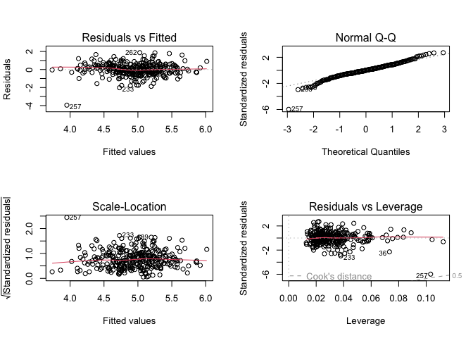

The residuals look much better with the transformation, however, observation 257 appears to be an outlier.
Let's look at the data to see if there's anything strange.


```r
plasma[257,]
```

~~~
##     Patient.ID age    sex smokstat quetelet vituse calories   fat fiber alcohol
## 257        257  40 Female    Never 31.24219  Often   3014.9 165.7  14.4       0
##     cholesterol betadiet retdiet betaplasma retplasma logbetaplasma
## 257       900.7     1028    3061          0       254             0
~~~

This observation has a plasma-beta level of 0, which is not possible in real life.
So, we should remove this observation and refit the data.


```r
plasma_no_na <- na.omit(plasma)
n <- which(plasma_no_na$Patient.ID == "257")
plasma_no_na <- plasma_no_na[-n,]
plasma_no_na$logbetaplasma <- log(plasma_no_na$betaplasma) # don't need +1 anymore as the 0 value has been removed

finalmodel <- lm(formula = logbetaplasma ~ age + quetelet + vituse + smokstat +
                 fiber + cholesterol + betadiet, data = plasma_no_na)
summary(finalmodel)
```

~~~
##
## Call:
## lm(formula = logbetaplasma ~ age + quetelet + vituse + smokstat +
##     fiber + cholesterol + betadiet, data = plasma_no_na)
##
## Residuals:
##      Min       1Q   Median       3Q      Max
## -2.05441 -0.37130 -0.02836  0.40989  1.91314
##
## Coefficients:
##                   Estimate Std. Error t value Pr(>|t|)
## (Intercept)      5.560e+00  2.574e-01  21.598  < 2e-16 ***
## age              4.807e-03  2.671e-03   1.800 0.072918 .
## quetelet        -3.200e-02  6.422e-03  -4.983 1.05e-06 ***
## vituseNotOften  -1.161e-02  9.696e-02  -0.120 0.904783
## vituseNo        -2.999e-01  8.962e-02  -3.347 0.000921 ***
## smokstatFormer  -1.093e-01  8.288e-02  -1.319 0.188108
## smokstatCurrent -3.145e-01  1.217e-01  -2.584 0.010231 *
## fiber            2.051e-02  8.244e-03   2.488 0.013396 *
## cholesterol     -7.940e-04  3.132e-04  -2.535 0.011752 *
## betadiet         5.264e-05  2.945e-05   1.788 0.074843 .
## ---
## Signif. codes:  0 '***' 0.001 '**' 0.01 '*' 0.05 '.' 0.1 ' ' 1
##
## Residual standard error: 0.6646 on 303 degrees of freedom
## Multiple R-squared:  0.2345,	Adjusted R-squared:  0.2118
## F-statistic: 10.31 on 9 and 303 DF,  p-value: 6.794e-14
~~~


```r
step(finalmodel, direction = "backward")
```

~~~
## Start:  AIC=-245.95
## logbetaplasma ~ age + quetelet + vituse + smokstat + fiber +
##     cholesterol + betadiet
##
##               Df Sum of Sq    RSS     AIC
## <none>                     133.82 -245.95
## - betadiet     1    1.4113 135.23 -244.67
## - age          1    1.4303 135.25 -244.62
## - smokstat     2    3.0718 136.89 -242.85
## - fiber        1    2.7332 136.56 -241.62
## - cholesterol  1    2.8379 136.66 -241.38
## - vituse       2    5.9915 139.81 -236.24
## - quetelet     1   10.9664 144.79 -223.30
##
## Call:
## lm(formula = logbetaplasma ~ age + quetelet + vituse + smokstat +
##     fiber + cholesterol + betadiet, data = plasma_no_na)
##
## Coefficients:
##     (Intercept)              age         quetelet   vituseNotOften
##       5.560e+00        4.807e-03       -3.200e-02       -1.161e-02
##        vituseNo   smokstatFormer  smokstatCurrent            fiber
##      -2.999e-01       -1.093e-01       -3.145e-01        2.051e-02
##     cholesterol         betadiet
##      -7.940e-04        5.264e-05
~~~


```r
res <- lm(formula = logbetaplasma ~ age + quetelet + vituse + smokstat +
          fiber + cholesterol + betadiet, data = plasma_no_na)
summary(res)
```

~~~
##
## Call:
## lm(formula = logbetaplasma ~ age + quetelet + vituse + smokstat +
##     fiber + cholesterol + betadiet, data = plasma_no_na)
##
## Residuals:
##      Min       1Q   Median       3Q      Max
## -2.05441 -0.37130 -0.02836  0.40989  1.91314
##
## Coefficients:
##                   Estimate Std. Error t value Pr(>|t|)
## (Intercept)      5.560e+00  2.574e-01  21.598  < 2e-16 ***
## age              4.807e-03  2.671e-03   1.800 0.072918 .
## quetelet        -3.200e-02  6.422e-03  -4.983 1.05e-06 ***
## vituseNotOften  -1.161e-02  9.696e-02  -0.120 0.904783
## vituseNo        -2.999e-01  8.962e-02  -3.347 0.000921 ***
## smokstatFormer  -1.093e-01  8.288e-02  -1.319 0.188108
## smokstatCurrent -3.145e-01  1.217e-01  -2.584 0.010231 *
## fiber            2.051e-02  8.244e-03   2.488 0.013396 *
## cholesterol     -7.940e-04  3.132e-04  -2.535 0.011752 *
## betadiet         5.264e-05  2.945e-05   1.788 0.074843 .
## ---
## Signif. codes:  0 '***' 0.001 '**' 0.01 '*' 0.05 '.' 0.1 ' ' 1
##
## Residual standard error: 0.6646 on 303 degrees of freedom
## Multiple R-squared:  0.2345,	Adjusted R-squared:  0.2118
## F-statistic: 10.31 on 9 and 303 DF,  p-value: 6.794e-14
~~~

Finally, checking the model plot diagnostics, we see that this model does not appear to violate any assumptions of multiple linear regression.


```r
par(mfrow = c(2, 2))
plot(res)
```
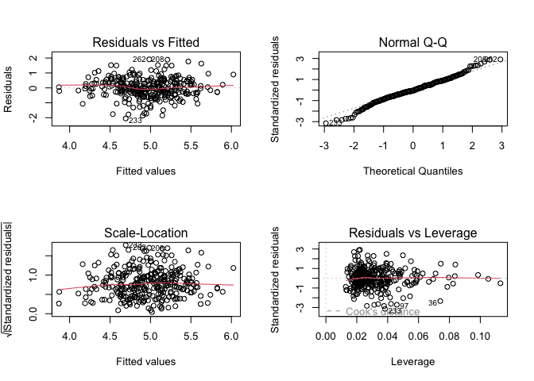
